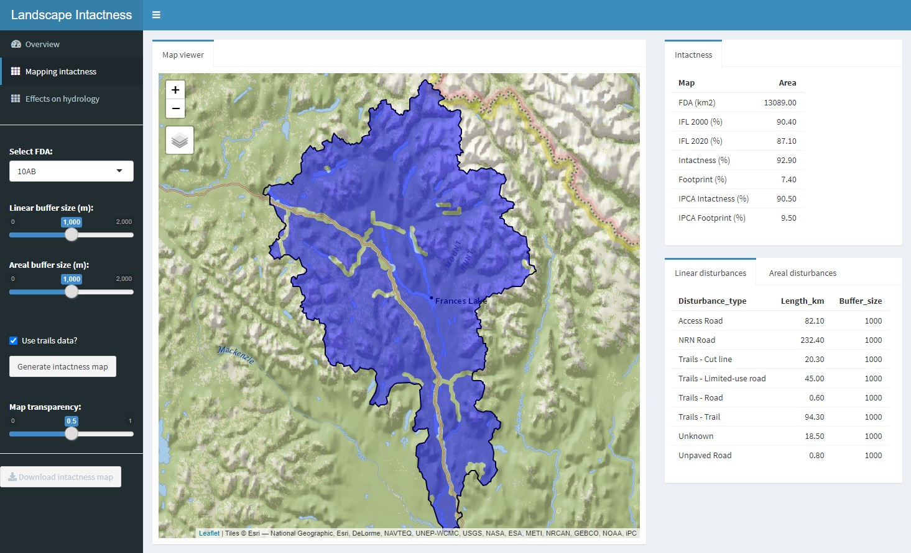

# Disturbance Explorer App

## Introduction

The purpose of the Intactness app is to enable users to interactively create a landscape intactness map or, conversely, a human footprint map. The app also allows users to assess the influence of buffer size and minimum patch size on the resulting intactness and footprint maps. The app relies on two key datasets: a cumulative linear disturbance map and a cumulative areal disturbance map. The two datasets should be contained in a geopackage and include several key attributes described below.

The app is intended to help answer the following questions:

1. What is the distribution and abundance of individual human disturbance types in my planning region?
2. What the cumulative impact of human disturbances? How does that change with assumptions about the area of influence of disturbances?
3. How much area is intact (not influenced by surface disturbances)? How does the estimated intact area vary with the size of buffers around linear and areal features? What is the size distribution of intact patches?
2. What is the "human footprint" of my planning region? How does the estimated footprint vary with assumptions about about area of influence and weights?

 
Figure 1. Shiny-based disturbance explorer app.

### Tutorials

1. Preparing your own data (Yukon version)
2. Estimating anthropogenic impacts
3. Performing a sensitivity analysis
