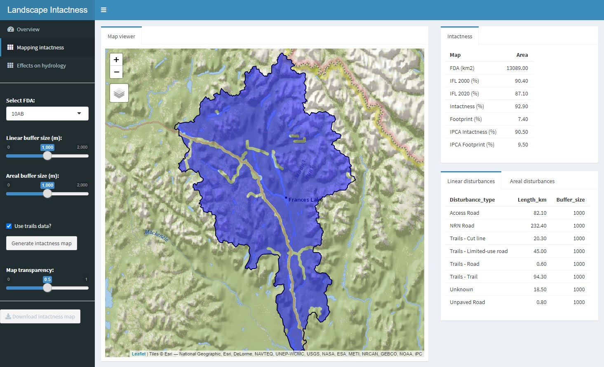

# Disturbance Explorer App

## Introduction

The purpose of the Intactness app is to enable users to interactively create a landscape intactness map or, conversely, a human footprint map. The app also allows users to assess the influence of buffer size and minimum patch size on the resulting intactness and footprint maps. The app relies on two key datasets: a cumulative linear disturbance map and a cumulative areal disturbance map. The two datasets should be contained in a geopackage and include several key attributes described below.

 
Figure 1. Shiny-based disturbance explorer app.

