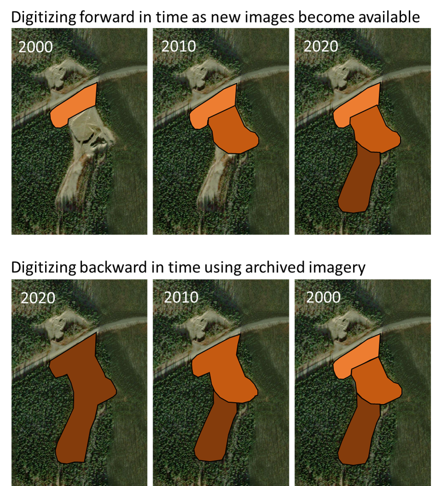
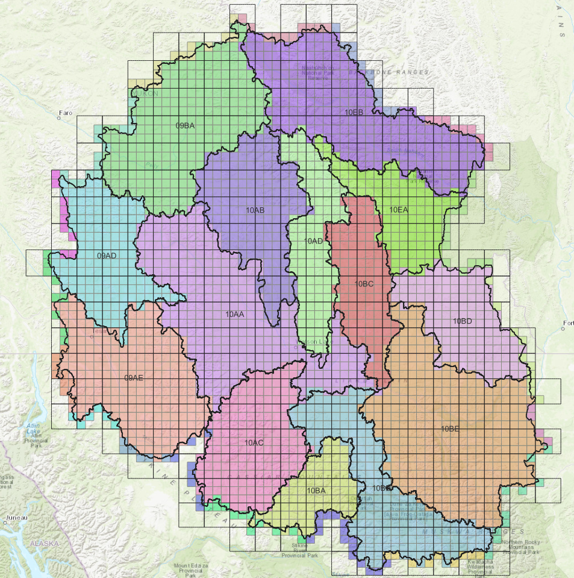

# Anthropogenic Surface Disturbance Mapping Procedures

The BEACONs Project

Updated: August 21, 2024

## Overview

This document provides the basic information needed to undertake an anthropogenic surface disturbance mapping project within an area of interest in the Yukon e.g., a watershed, caribou range, or other ecological and administrative boundaries. For additional information, we refer technicians to the accompanying documentation provided by the Yukon Government[^1]. The goal of a mapping project is to produce two GIS data layers for a given project area: one containing linear surface disturbances and the other containing areal (polygonal) surface disturbances. Anthropogenic surface disturbances include any feature created by human activities that is visible on satellite or aerial imagery. 

This document contains the following sections:

* Project data package \- A description of the datasets and digitizing template files that are provided in the data package, including a description of linear and polygonal attributes.  
* Digitization methods \- Detailed procedures for mapping linear and polygonal disturbances, and assigning attributes to each disturbance.  
* Three appendices describing 1\) industry and disturbance types, 2\) a basic project workflow, and 3\) some project management considerations. 

## Project data package

Each disturbance mapping assistant will be provided with a QGIS project file and associated data package. The project data package contains the following data and documents:

* A QGIS project file containing (Table 1):  
  * A boundary layer outlining the project area of interest (AOI). This could be a watershed, caribou range, or other area of interest.  
  * Existing linear and polygonal surface disturbance layers containing the national road and railway networks (NRN, NRWN), and additional features (if any) mapped by the Yukon Government.  
  * Empty linear and polygonal layers that can be used for digitizing new features.  
  * A 1-km2 grid for tracking progress.  
  * Several ancillary datasets to aid in digitizing.  
  * Satellite imagery, available as a web service, on which to digitize disturbance features.  
* This document along with the Yukon Government Mapping Standards Document and Feature Interpretation Key.

### Data layers

The project data package consists of several data layers which are listed in Table 1\. The first four groups of layers will be included with all data packages while the supporting layers will only be included where they may be helpful e.g., cutblocks would be included in an AOI that included harvesting. The satellite imagery will need to be added as web services. This is explained in the next section.

Table 1\. Map layers in the data package include digitizing templates, reference layers, existing disturbance layers, and other supporting (ancillary) layers. Satellite imagery needs to be added as web services. Additional layers can be added depending on the area of interest. 

| Group | Layer names | Description |
| :---- | :---- | :---- |
| Digitizing templates (these are empty but contain all req’d attributes) | BP\_Poly | The layer to digitize in, for digitizing areal features like mines, road pull outs, campsites etc. |
|  | BP\_Line | The layer to digitize in, for digitizing linear features like roads, trails, seismic lines etc. |
| Satellite Imagery | GeoYukon:  \- MedRes\_Update | Yukon-wide SPOT mosaic for 2020-21. This is the main imagery used for identifying and digitizing disturbances |
|  | GeoYukon:  \- HighRes | Patchily available but can be used where available or if it is more recent than the SPOT MedRes mosaic |
|  | ESRI and Google Imagery | Can be used to help identify boundaries or disturbance types, but generally not for digitizing except for features only visible on this basemap |
| Reference layers | Boundary | Boundary of project area of interest (AOI) |
|  | Grid\_100km2 | Large grid for tracking digitizing progress |
|  | Grid\_1km2 | Fine grid for tracking digitizing progress |
| Existing disturbance layers | YG\_Line | To aid in identifying and classifying disturbances; includes the national road network (NRN) and national railway network (NRWN) from Canvec |
|  | YG\_Poly | To aid in identifying and classifying disturbances |
|  | YG\_MappingExtent | Spatial extent of YG surface disturbance mapping |
| Supporting layers | Canada\_Access\_2010 | Canada-wide surface disturbance map from 2010\. May useful in areas with no previous disturbance mapping |
|  | Fire\_History | Polygons of past fires. Sometimes cut blocks and fires can look similar |
|  | Quartz\_Claims\_50k | Surface disturbances inside these claims areas are likely associated with quartz mining |
|  | Placer\_Claims\_50k | Surface disturbances inside these claims areas are likely associated with placer mining |
|  | Watercourses\_50k\_Canvec | Rivers, can sometimes look like trails |
|  | Historic Silviculture Activities \- 50k | GeoYukon web service showing the location of historic cutblocks |

#### Adding web services

Some of the map layers listed in Table 1 (e.g., Satellite imagery, Historic Silviculture) will need to be added as web services in QGIS or ArcGIS. For instructions on adding web services to either QGIS or ArcGIS, go to the following websites:

* QGIS: [https://docs.qgis.org/3.28/en/docs/training\_manual/online\_resources/wms.html](https://docs.qgis.org/3.22/en/docs/training\_manual/online\_resources/wms.html)   
* ArcGIS: [https://desktop.arcgis.com/en/arcmap/latest/map/web-maps-and-services/adding-arcgis-server-map-services.htm](https://desktop.arcgis.com/en/arcmap/latest/map/web-maps-and-services/adding-arcgis-server-map-services.htm)

Use the instructions above to add the following map services:

* SPOT 2020-21 mosaic from GeoYukon:  
  * [https://mapservices.gov.yk.ca/imagery/rest/services/Satellites/Satellites\_MedRes\_Update/ImageServer](https://mapservices.gov.yk.ca/imagery/rest/services/Satellites/Satellites\_MedRes\_Update/ImageServer)  
* High and medium resolution imagery from GeoYukon  
  * [https://mapservices.gov.yk.ca/imagery/rest/services/Satellites/Satellites\_HighRes/ImageServer](https://mapservices.gov.yk.ca/imagery/rest/services/Satellites/Satellites\_HighRes/ImageServer)  
* ESRI imagery   
  * [https://server.arcgisonline.com/ArcGIS/rest/services/World\_Imagery/MapServer/tile/{z}/{y}/{x](https://server.arcgisonline.com/ArcGIS/rest/services/World\_Imagery/MapServer/tile/{z}/{y}/{x)}  
* Google imagery  
  * [https://mt1.google.com/vt/lyrs=s\&x={x}\&y={y}\&z={z](https://mt1.google.com/vt/lyrs=s\&x={x}\&y={y}\&z={z)}   
* Historic Silviculture Activities \- 50k  
  * [https://mapservices.gov.yk.ca/arcgis/rest/services/GeoYukon/GY\_Forestry/MapServer](https://mapservices.gov.yk.ca/arcgis/rest/services/GeoYukon/GY\_Forestry/MapServer) 

### Disturbance attributes

Attributes for the BP\_Line and BP\_Poly digitizing files are based on those used by the Yukon Government for their surface disturbance mapping. Attributes for mapping both lines and polygons are shown in Table 2\. Two of the key attributes are the industry type (TYPE\_INDUSTRY) and the disturbance type (TYPE\_DISTURBANCE). Possible values are listed in Appendix 1\. Comments on disturbance types or uncertainties in mapping can be entered in the NOTES attribute. Features can be flagged as important for validation or ground truthing using the FLAG attribute with details included in NOTES. Additional details about specific attributes can be found in the “Digitization methods” section.

Table 2\. Attributes, data types, domains, and descriptions of linear and areal disturbances in the BEACONs digitizing template files. The bold attributes only apply to linear disturbances. The last 6 attributes in blue are BEACONs specific.

| Attribute | Data Type | Domains | Description |
| :---- | :---- | :---- | :---- |
| REF\_ID | Text (100) |  | Unique feature reference ID \- leave blank |
| DATABASE | Text (12) | Historic, Most Recent, Retired | Sub-database to which the feature belongs |
| TYPE\_INDUSTRY | Text (20) | See Table 3 | Major classification of disturbance feature by industry |
| TYPE\_DISTURBANCE | Text (30) | See Table 3 | Sub classification of disturbance feature (see Table 3\) |
| WIDTH\_M | Double |  | Width of feature in metres to the nearest whole number |
| WIDTH\_CLASS | Text (5) | HIGH, MED, LOW | Width of feature by classification (no longer used) |
| SCALE\_CAPTURED | Long |  | Scale at which the feature was digitized, generally 1:5000 (value=5000) |
| DATA\_SOURCE | Text (10) | Imagery, GPS, NRN, NRWN | Digitized from imagery, captured by GPS, adapted from the NRN or NRWN, or obtained by other means |
| IMAGE\_NAME | Text (100) |  | Filename of source imagery (e.g., SPOT 2020-2021 Mosaic / ESRI World Imagery) *Specify where and how to find this information i.e. geoyukon identify imagery*|
| IMAGE\_DATE | Date |  | Date that imagery was captured |
| IMAGE\_RESOLUTION | Double |  | Resolution of source imagery in metres |
| IMAGE\_SENSOR | Text (35) |  | Name of sensor that captured source imagery |
| CREATED\_BY | Text (25) | USER | User that created/digitized a feature |
| CREATED\_DATE | Date |  | Date feature was created/digitized |
| FEATURE\_VISIBILITY | Text (25) | VISIBLE, INTERPOLATED | Indicates whether the feature is visible and interpreted from the imagery, or if it was interpolated because the feature was obscured, but known to be present. |
| DISTURBANCE\_YEAR | Integer (4) |  | Year that the disturbance appeared on the landscape |
| FLAG | Short Integer (1) |  | Feature is a high priority for validation (mark with value 1\) |
| FLAG\_YG | Short integer (8) | REF\_ID from YG\_Line or YG\_Poly | YG Feature is flagged for consideration for removal from the YG database |
| VHR\_ASSIST | Text (10) | ESRI, Google, Bing | Name of VHR imagery, if any, used to aid in digitizing |
| NOTES | Text (200) |  | Notes |

## Digitization methods

### General approach

The following bullets provide important information about the general approach used to digitize linear and polygonal surface disturbances:

* **Previously mapped surface disturbances**  
  * Each project file contains existing linear and polygonal disturbance layers (YG\_Line and YG\_Poly) which, at a minimum, includes the national road and railway networks (NRN and NRWN). These layers should never be modified. Depending on your project area, the layers may also contain additional surface disturbances that were mapped by the Yukon Government. You do not need to re-digitize existing features unless they are obviously wrong or they have changed in size or shape e.g., mining expansion.  
  * What to digitize on your disturbance layers (BP\_Line and BP\_Poly):  
    * Visible features that were not previously digitized i.e., they do not exist in the YG\_Line and YG\_Poly layers. This includes features that are in proximity to existing (previously digitized) features or in newly disturbed areas e.g., a new mining project.  
    * Existing features that have changed in shape and size since last digitized e.g., mining expansion. Digitize the entire feature that has changed, not just the additions.  
    * Existing features that do not appear to represent the feature correctly e.g., errors or features that were previously digitized using older and coarser imagery.  
* **Tracking progress using the 1-km2 grid**   
  * You can use the 1-km2 grid provided in your data package to guide your progress. One approach is to start at the top row and work from left to right, then move on to the next row, and so on. A value of 1 can then be entered in the “status” field to indicate that it has been reviewed and features, if any, digitized. This value can be added directly or noted on a piece of paper or text editor and added at the end of a session.  
* **Scale of capture**  
  * Digitizing should always be done at 1:5,000 using ≤1.5m resolution satellite imagery e.g., SPOT 2018-21 mosaic or ESRI/Google imagery. Simply select the correct scale from the Scale drop-down box at the bottom of the screen. Depending on the resolution of your monitor, you may be able to see two 1-km2 grids at that scale.  
* **Digitize features completely**  
  * Start in the first 1-km2 grid cell and digitize all disturbances that can be seen.  
  * If the feature being digitized leaves the grid cell, digitize it completely then return to the grid cell you were in. e.g. if a road crosses out of your first grid cell, digitize it in full, then return to grid cell one and digitize the next feature.  
  * The same procedure can be used if the feature you are digitizing crosses the project AOI, unless you know that someone else has already digitized the feature.  
  * Features should only be divided into separate entries when an attribute changes, such as the underlying imagery date, the width of a road, or if a trail turns into a road.  
* **Identifying disturbances**  
  * If a potential disturbance is identified, use the **Supporting layers** to help identify the feature and decide if it is a disturbance. Toggle the different supporting layers on and off to help pinpoint any disturbances. Small disturbances may be easily missed otherwise. For example:  
    * Sometimes rivers look like roads/trails, toggle the Water courses layer to check.  
    * Sometimes fires look like cutblocks or clearings, toggle the Fires layer to check.  
* **Classifying disturbances**  
  * Disturbances are classified using the TYPE\_INDUSTRY and TYPE\_DISTURBANCE attributes found in Appendix 1\.   
  * Use the **Supporting layers** to help classify the disturbance. For example:  
    * Linear features could be powerlines, or seismic lines, or trails/roads. Toggle the various layers to check.  
    * A mine site in a quartz claim area can be assumed to be TYPE\_INDUSTRY: ‘Mining’ and TYPE\_DISTURBANCE: ‘Quartz mining significant’.  
    * A small settlement on a lake un-connected to any roads might be identified as TYPE\_INDUSTRY: ‘Rural’ and TYPE\_DISTURBANCE: ‘Camp’ by checking the **Tourism layer** for any nearby fishing locations.  
* **Flagging for field validation**  
  * If the spatial boundary or attribute assignment of a digitized feature is uncertain, it can be flagged for validation. A value of 1 should be assigned to the FLAG field and any notes relevant to the flag should be added in the NOTES attribute.  
  * Examples could be an old trail that needs to be ground truthed to check its location and if it’s still active; or a feature where the digitizer is not certain about the disturbance type and wants a second opinion. FLAGs should always have an associated NOTE describing why the feature was flagged.  
* **Topology rules**  
  * Polygons must not overlap other polygons where both represent current disturbances on the landscape. It’s possible polygons could overlap in the future if an older disturbance is no longer considered current (Note that, unlike YG, we do not yet have a procedure for archiving disturbances that are no longer present).  
  * Lines must not overlap lines (i.e. two lines should not share multiple points on top of each other), but they can intersect and cross other line features.   
  * Lines can overlap with polygons and digitizing of linear features that pass through a polygon is required  (this could be useful for tabulating the total length of linear features in the dataset for example).   
  * Features must be single-part not multi-part. However, make sure to split a feature every time an attribute changes, including the imagery date or feature width.  
  * Lines and polygons should snap to polygons where they are adjacent to each other.  
  * Linear features should be collected as a polyline geometry regardless of their width.

### Satellite image priority

Ideally all features should be digitized using the primary reference image which, in this project, is the 1.5m resolution SPOT 2020-21 mosaic (GeoYukon MedRes\_Update) available until March 31, 2024\. In some areas, additional permanent HighRes imagery may be available but should only be used if it is more recent than the mosaic. Another source of imagery is Very High Resolution (VHR) imagery such as ESRI and Google imagery. These can have much finer resolution (e.g. 0.5m) but do not have a consistent reference year. The basemap tiles are often made up of old and newer imagery and sometimes the reference year information is not available (e.g., ESRI basemap reference year can be seen using the info tool in ArcMap but not in QGIS).

VHR data can be useful in combination with the SPOT data when searching for disturbances, and for confirming disturbance types. In some cases, disturbances may be visible in the VHR that are not visible in the SPOT data, in which case the VHR data can be used for digitizing (with the caveats mentioned below).

When digitizing, make sure to determine the date of the imagery that was used to digitize a feature. Currently, the only way to do this is to go to the GeoYukon mapping website ([https://mapservices.gov.yk.ca/GeoYukon/](https://mapservices.gov.yk.ca/GeoYukon/)), turn on the “Medium Resolution Satellites \- Current” layer, press the “Identify Imagery” button at the top of the map, and then click on the location where the newly digitized feature is located (you will need to zoom in to the appropriate area, guided by the imagery). The panel on the left will indicate the year of imagery \- use the information listed under “Medium Resolution Satellites”.

Digitizing should be done following the three options below, with priority given in this order (i.e. digitizing using SPOT imagery is the priority if possible):

1. **Disturbance is clearly visible in SPOT imagery**:   
   1. Digitize using SPOT 2020-21 mosaic (GeoYukon MedRes\_Update)  
   2. Assign IMAGE\_NAME,  attribute as “SPOT-6/7 Mosaic (2020-2021) Planet Labs”, IMAGE\_RESOLUTION as “1.5”, IMAGE\_SENSOR as “SPOT-6/7”, and IMAGE\_DATE as identified from the GeoYukon website (see previous paragraph).  
   3. Assign VHR\_ASSIST attribute as NA because no other imagery was required to identify and map the disturbance.  
2. **Disturbance is visible in SPOT imagery, but VHR (e.g. ESRI) is needed to identify the disturbance type, and possibly inform/confirm the outline:**  
   1. Digitize using SPOT 2020-21 mosaic (GeoYukon MedRes\_Update)  
   2. Assign IMAGE\_NAME attribute as “SPOT-6/7 Mosaic (2020-2021) Planet Labs”, IMAGE\_RESOLUTION as “1.5”, IMAGE\_SENSOR as “SPOT-6/7”, and IMAGE\_DATE as identified from the GeoYukon website (see previous paragraph).  
   3. Assign VHR\_ASSIST attribute as “ESRI World Imagery” because ESRI basemap was needed to assist digitizing.  
3. **Disturbance is clearly visible in ESRI imagery and cannot be digitized using SPOT imagery:**  
   1. Digitize using ESRI imagery  
   2. Assign IMAGE\_NAME as “ESRI World Imagery”. Use the info tool in ArcMap to get the RESOLUTION, SENSOR and IMAGE\_DATE values. As an alternative, use the ESRI World Imagery Wayback site ([https://livingatlas.arcgis.com/wayback](https://livingatlas.arcgis.com/wayback)) to try to identify the year of imagery.  
   3. Assign VHR\_ASSIST attribute as “ESRI World Imagery” (validation step will check VHR\_ASSIST is always ESRI when IMAGE\_NAME is ESRI).

### Digitizing with QGIS

See the QGIS [documentation (section 5.1)](https://docs.qgis.org/3.28/en/docs/training\_manual/create\_vector\_data/create\_new\_vector.html) for more details.

#### Digitizing a polygon

1. Right click on the **Attributes Toolbar** at the top of the QGIS window and make sure the **Digitizing Toolbar** is selected.   
2. Click on the layer name (i.e., BP\_Poly) in the **Layers** menu to select it, then click on **Toggle Editing**, either in the **Digitizing Toolbar** or by right clicking on the layer name in the **Layers** menu. This makes the layer editable which allows us to digitize new disturbance polygons.  
3. Click on **Add Polygon Feature** in the **Digitizing Toolbar**. You can now draw the feature.   
4. When the feature is complete, right click on the map. A window will open where you can fill in the attributes for the new feature. Fill in the attributes then click **OK**. \[Alternatively, you can leave the attributes NULL and fill them in later by right clicking on the layer name and selecting **Open Attribute Table**; attributes of all features can be edited directly in the table as long as the layer is editable\].  
5. Save edits regularly by clicking **Save Layer Edits** in the **Digitizing Toolbar**.  
6. When digitizing is complete, turn off editing for the layer by clicking the **Toggle Editing** button again.

#### Digitizing a line

1. Same as digitizing polygons but select the line layer (i.e., BP\_Line) to edit.  
2. The line attribute table has an additional attribute **WIDTH\_M**. Estimate the width of the linear feature in metres, and rounded to the nearest whole number. Use the **Measure Line** tool in the **Attributes Toolbar** for this. Set the distance to metres and click across the width of the road. You will likely have to zoom in on the map to do this. If the width of the feature varies, take the average of several measurements.

Note that when you save the project file at the end of a work session you will also maintain the current map view.

### Which features to map?

Each project area is divided into a grid consisting of 1\) 100-km2 cells and 2\) 1-km2 cells. Both grids include a binary attribute called “Priority”, which indicates the cells that should be evaluated and mapped. The larger grids can be used to track overall progress and record notes (Google spreadsheet) while smaller grids can be used to help guide the digitizing progress. Only 1-km2 grid cells with a Priority value of 1 need to be reviewed and digitized. These are the areas that either have never been mapped or have been recently mapped using older SPOT data.

**There are several possible scenarios**:

1. The area is unmapped. In this case, any features detected need to be digitized (DATABASE \= “Most Recent”).  
2. The area has been mapped correctly i.e., no new features or changes to existing features can be detected using SPOT 2020-21 imagery. In this case, nothing needs to be done.  
3. The area has been mapped but:  
   1. Not all features have been mapped i.e., some features that can be detected using SPOT 2020-21 imagery were previously missed or did not exist on older SPOT imagery. In this case, the features need to be digitized (DATABASE \= “Most Recent” in the BP\_Line or BP\_Poly layer).  
   2. Some features have changed in size and/or shape i.e., a feature that was correctly mapped using older SPOT imagery has since changed size and/or shape. In this case, the features need to be digitized completely (DATABASE \= “Most Recent” in the BP\_Line or BP\_Poly layer) and the older feature re-attributed (Database \= “Historic” in the YG\_Line or YG\_Poly layer).  
   3. Some features have been incorrectly mapped using the older SPOT imagery.  In this case, the features need to be re-digitized completely (DATABASE \= “Most Recent” in the BP\_Line or BP\_Poly layer) and the older feature re-attributed (Database \= “Retired” in the YG\_Line or YG\_Poly layer).

**In all cases make sure to**:

* Keep the original feature in the YG\_Line or YG\_Poly layer i.e., do not delete the original.  
* Digitize the feature needing to be remapped in the BP\_Line or BP\_Poly layer.  
* Add the REF\_ID from YG\_Line or YG\_Poly of the feature being remapped to the FLAG\_YG field in the BP\_Line or BP\_Poly layer.

For further information, see pages 21-24 in the YG manual.

### Validating mapped features

Procedures for validating linear and polygonal disturbances will be developed in the near future.

> Hugues: YG seem to have retired features based on past imagery that we re-digitized as it appears clearly on recent imagery. Suggest that ground truthing should be performed before retiring disturbances or keeping track of a number of digitizing iterations in which the feature doesn't appear before retiring.

## Developing a temporal disturbance database

A temporal disturbance database contains a year or date of occurrence for every feature. In our case this data is stored in the DIST\_YEAR attribute. This is the date that the disturbance appeared on the landscape and is different to the IMAGE\_DATE which is the year the satellite imagery was taken. In the absence of an accurate DIST\_YEAR, the IMAGE\_DATE is the best information we have about when a disturbance occurred, but in almost all cases the DIST\_YEAR will be earlier than the IMAGE\_DATE.

### Identifying disturbance dates

**Manual dating method**

The manual method for assigning disturbance dates is to use yearly imagery to identify when a disturbance shows up on the landscape. Since many areal disturbances will grow incrementally over time, we will need to digitize the older polygons and subtract those areas from the current polygon to get a set of non-overlapping polygons with the correct years assigned. The following procedure can achieve this:

1. Setup  
   1. Open a GIS project with the areal and linear disturbance layers  
   2. Add yearly imagery for all available years. This could be PLANET imagery for recent years, followed by LANDSAT. For PLANET imagery, we could use their basemap products for the third quarter (or a pre-snowfall monthly imagery). Cloud free LANDSAT images may need to be downloaded and merged from google earth engine or [USGS Earth Explorer](https://earthexplorer.usgs.gov/) (or they might be available in the PLANET QGIS plugin). Create folders for each decade (1980s, 1990s and so on), and load imagery in five year intervals if possible. Delete the images  that don’t overlap the project area. Add high and medium resolution satellite imagery and air photos from GeoYukon with the metadata layers. Set metadata symbology (hollow) and add labels (year acquired). Load other imagery, such as Planet imagery, if available. Some of the imagery may require additional processing, such as merging tiles or building a virtual raster, or adjusting the appearance settings under symbology.   
   3. Arrange the yearly imagery in chronological order in the GIS project  
   4. Ensure the BP and YG line and polygon files are prepped. Imagery and sensor names should be added to the BP layer drop down lists, the DISTURBANCE\_YEAR and FLAG fields should be added to the YG layers, and the YG layers’ symbology should be categorized by DATABASE to ensure RETIRED features are not getting dates assigned during this stage.   
   5. Load ancillary data from GeoYukon. Load Land Tenure layers, specifically Land Dispositions, Land Notations, Land Licenses, Historical Land Use Permits \- Polygon and Historical Land Use Permits \- Line. Also load the Historical Mineral Claim layer. Add the disposition date as a label; if unavailable, use the start date.   
   6. Download and open Google Earth Pro. Export a kml file of each BP and YG line and polygon layer from the QGIS project, and import the kml files to Google Earth Pro. Turn on the historical imagery slider.   
2. Search  
   1. Use the 100 km and 1 km grids to guide you, and track your progress in the digitizing spreadsheet. Use Google Earth Pro’s timeline feature as a resource to help identify the time frame when a disturbance appeared. Use the additional imagery and ancillary layers in QGIS to try to narrow down the exact year the disturbance appeared.   
   2. For each disturbance feature, toggle the yearly imagery until you find the year in which the feature appears on the landscape. If the full feature appears in that year, assign the year as the DIST\_YEAR and move on to the next feature. Only edit the attribute table using QGIS (not Google Earth Pro).   
   3. If the feature is present in all images, then it must be older than the imagery we have available. We can’t assign a DIST\_YEAR in these cases unless we find older imagery or use an alternate dating method. In the absence of older imagery can we label the DIST\_YEAR as for example *\-2000* if our oldest imagery is from the year 2000\.  
   4. If feature dates cannot be addressed/need to be revisited, flag with a “2” in the FLAG field and leave a note explaining the issue. If the feature can no longer be seen due to very poor imagery resolution but you suspect it was still present, note the last year the feature was visible with a “-” (e.g., \-1990) and then flag the feature with a “2”.   
   5. Once a 100 km grid is complete, change the status field to “2” and mark as done in the digitizing spreadsheet.  
3. Digitize  
   1. If only a portion of a feature shows up in a given year, the disturbed area for that year should be digitized and then removed from the present day polygon using the ArcGIS Erase tool or QGIS Difference tool. \[ME note: This should be tested in the initial stage, but it may be something we leave until the end (i.e., when all features have dates and changing polygons have been digitized). My first attempt with the difference tool resulted in a new layer being created that didn't show up on the map for some reason. If a new layer is created each time the tool is used, it may be best to leave this step for the very end.\] Some features (e.g. mine sites) may end up being composed of many polygons each with different DIST\_YEAR values. The goal is to maintain a flat dataset as shown in Figure 1\. Digitizing should only be done in BP\_poly and BP\_line, even if the feature was initially digitized by YG. Previous versions of a feature (such as a gravel pit that has grown over time) should be set to “Historic” under the DATABASE field. 

Figure 1\. Examples of digitizing forward in time as new imagery becomes available, vs digitizing backward in time using archived images. In the above example we assume that the disturbance feature grew over the three timesteps (i.e. in the top left image, the orange polygon should represent the full extent of the disturbance in 2000). When digitizing forward, only the newly added sections of disturbance are digitized. When moving backward, the 2020 polygon needs to be split into three polygons, each with the correct date assigned.

**Alternate dating methods**

For disturbances that cannot be dated using the method above, some alternatives are listed below. These methods do not permit the digitizing step described above so are only valid if the entire feature can be assigned a single DISTURBANCE\_DATE value.

1. Imagery that cannot be loaded into the GIS project. e.g. Google Timelapse.  
   1. Google Timelapse and Google Earth Pro allow you to scroll through years to see changes. We can easily do this to find the year a feature appears, then switch to our GIS project to label the feature. One advantage of this approach is that they have cloud free images which are not always available by accessing our own LANDSAT images.  
   2. We could also import our shapefile into Google Earth Pro which would allow us to digitize on the timelapse imagery. This is not an optimal workflow because switching between two GIS platforms is slow and could introduce unforeseen bugs. That said, the workflow would be:  
      1. Import disturbance shp into Google Earth Pro. It will be converted to a kml  
      2. Digitize as needed  
      3. Convert back to shapefile using ESRI toolbox or QGIS equivalent  
      4. I don’t think Google Earth Pro preserves the attribute table so attributes would have to be added back in QGIS/ArcGIS  
2. Government records (these may often be dates of licenses and not necessarily disturbance dates)  
   1. YESAB registry  
   2. GeoYukon  
      1. GeoYukon has a 1990-2000 image that could be useful for dating disturbances that occur in that decade

3. Online research (e.g. this [fishing camp](https://inconnulodge.com/inconnu-lodge.php) website describes the history and building of the lodge)

### Limitations

Assigning dates has a number of issues that need to be addressed:

* It’s much easier to assign dates to larger features such as mines, cutblocks etc. Some roads and smaller features will be impossible to date because they don’t show up in the older imagery (i.e. LANDSAT @ 30m)  
* Dating will be easier for more recent disturbances than for older ones because image quality and availability will decrease the further back you go.

##

## Appendix 1\. Industry and disturbance types

Industry and disturbance types are taken from the Anthropogenic Surface Disturbance Mapping in the Yukon, Standards and Guidelines for Contractors, v 4.0.2 (Tables 4 and 7). Examples of each disturbance type can be seen in Anthropogenic Surface Disturbance Mapping in the Yukon, Feature Interpretation Key for Contractors, v 1.0.2. Highlighted disturbance types are those we expect to occur most frequently in our study region. **Note 1**. Placer mining \- major vs minor: minor placer mines are single projects in isolation, major placer mines are back to back projects covering an entire valley or region. **Note 2**. Trails vs. unpaved roads: unpaved roads have been developed and are wide enough for a truck to go down. Trails are undeveloped and narrow enough that a truck wouldn't fit down them.

|  |  |  |  |
| :---- | :---- | :---- | :---- |
| **Industry type** | **Feature type** | **Disturbance type** | **Description** |
| Agriculture | Areal | Agriculture | Farms, ranches, or other agricultural areas |
| Forestry | Areal | Forestry | Cut blocks or other forestry related activities |
| Mining | Areal | Building | A building footprint or the building and the surrounding land related to mining activities |
|  |  | Drill Pad | Drill pad features related to mineral exploration activities |
|  |  | Fuel Cache | Remote caches of fuel allowing for mineral exploration activities (will often have fuel tanks and barrels) |
|  |  | Gravel Pit / Quarry | Pit or quarry for mining gravel or aggregate |
|  |  | Laydown area | Areas used to store materials and equipment for mining operations |
|  |  | Mining | Miscellaneous or unknown mining activities |
|  |  | Placer Mining \- Minor | Placer mining area with little disturbance |
|  |  | Place Mining \- Significant | Placer mining area with greater disturbance |
|  |  | Quartz Mining \- Minor | Quartz mining area with little disturbance |
|  |  | Quartz Mining \- Significant | Quartz mining area with greater disturbance |
|  |  | Tailing Pond | Tailing pond associated with mining activity |
|  |  | Camp | Mining camp |
|  | Linear | Diversion Channel | An engineered linear bypass feature that redirects a watercourse around a mining feature such as a tailings pond |
|  |  | Survey / Cutline | A linear cleared area through undeveloped land, used for line-of-sight surveying; impossible to distinguish whether associated with quartz or placer mining (overlapping or unclear claims information) |
|  |  | Survey / Cutline \- Placer | A linear cleared area through undeveloped land, used for line-of-sight surveying; associated with placer mining (identified using claims information and/or other indicators) |
|  |  | Survey / Cutline \- Quartz | A linear cleared area through undeveloped land, used for line-of-sight surveying; associated with quartz mining (identified using claims information and/or other indicators) |
|  |  | Trench | A long, narrow excavation dug to expose vein or ore structure |
|  |  | Unknown | Unknown linear mining disturbance |
| Oil and Gas | Areal | Well Pad | Cleared area surrounding oil or gas well |
|  |  | Unknown | Added by BEACONs 2024-02-27 |
|  | Linear | Pipeline | Visible pipeline or pipeline Right-of-Way (above- or below-ground) |
|  |  | Seismic Line | Seismic lines |
| Rural | Areal | Camp | Any camp outside of mining areas, including fishing/hunting camps, ENV conservation officer cabins/camps, outfitters, etc. |
|  |  | Homestead | Rural dwelling and associated land |
|  | Linear | Driveway | A driveway in a rural area |
|  |  | Fence | A fence in a rural area |
| Transportation | Areal | Airstrip | Airport or Airstrip |
|  |  | Clearing | Clearings that are related to transportation but could not be clearly attributed as a turn area, pullout, road cut and fill, etc. |
|  |  | Gravel Pit / Quarry | Gravel pits related to transportation |
|  |  | Pullout / Turn Area | An area associated with transportation and is intended as a vehicle pullout or turn area |
|  |  | Road Cut and Fill | Cut slopes and moved earth for road construction purposes |
|  |  | Unknown | Added by BEACONs 2023-11-28 |
|  | Linear | Access Assumed | A linear feature that is assumed to be an access road, but could also be a trail |
|  |  | Access Road | A road or narrow passage whose primary function is to provide access for resource extraction (i.e. mining, forestry) and may also have served in providing public access to the backcountry. |
|  |  | Arterial Road | A major thoroughfare with medium to large traffic capacity |
|  |  | Local Road | A low-speed thoroughfare, provides access to front of properties, including those with potential public restrictions such as trailer parks, First Nations land, private estate, seasonal residences, gravel pits (NRN definition for Local Street/Local Strata/Local Unknown). Shows signs of regular use. |
|  |  | Right of Way | For Road Rights as attributed in the land parcels ancillary data |
|  |  | Trail | Path or track used for walking, cycling, ORV, or other backcountry activities. (Note: trails used for mining activities are Access Roads.) |
|  |  | Unpaved Road | Dirt or gravel road  that does not necessarily access remote resources |
|  |  | Railway | Added by BEACONs 2023-11-28 |
|  |  | Unknown | Added by BEACONs 2023-11-28 |
| Unknown | Areal | Clearing | A tract of land devoid (or nearly devoid) of natural land cover and suspected to be anthropogenic in nature |
|  |  | Gravel Pit / Quarry | A gravel pit with unknown related industry |
|  |  | Unknown | Unable to identify from imagery, but suspected to be anthropogenic |
|  | Linear | Right of Way | A right of way with unknown industry type |
|  |  | Survey / Cutline | A linear cleared area through undeveloped land, used for line-of-sight surveying. A cutline may not always be associated with mineral exploration, therefore, Type: Unknown was used to differentiate all cutlines that were outside of mineral exploration. |
|  |  | Unknown | Unclassified, or unable to identify type based on imagery, but suspected to be anthropogenic |
| Urban | Areal | Building | Visible building or structure |
|  |  | Cemetery | Cemetery |
|  |  | Clearing | Miscellaneous urban clearings |
|  |  | Cul-de-sac / Turn Area | A turn area associated with transportation or road cul-de-sac |
|  |  | Dam | Barrier impounding water or stream |
|  |  | Golf Course | Recreational golfing area |
|  |  | Industrial | Areas that are designated for industrial uses: factories, tank farm, transportation area |
|  |  | Institutional | Any institutional buildings and immediate cleared area: School, government, etc. |
|  |  | Landfill | Site used for disposal of waste materials |
|  |  | Pond | Standing body of water, created anthropogenically; includes sewage lagoons, wastewater facilities, and artificial bodies of water |
|  |  | Recreation Area | Visible disturbance in Urban / Rural parks and recreation areas |
|  |  | Rural Residential | Land use in which housing predominates in an urban or community setting |
|  |  | Tower | A tall structure, possibly used for communications or forestry |
|  |  | Urban | Miscellaneous or unknown urban features |
| Utility | Linear | Electric Utility Corridor | Corridor usually running parallel to highway, where transmission lines or other utilities are visible |
|  |  | Unknown | Unknown linear feature assumed to be a utility corridor; ancillary data is unclear |

## 

## Appendix 2\. Project workflow

The following steps describe the disturbance mapping workflow for one area of interest (AOI), from preparing a data package for digitizing to merging the newly digitized features with existing disturbance features. All of the steps can be completed using QGIS and are appropriate for projects that are conducted with Yukon and/or BC. Where procedures differ by jurisdiction, both Yukon and BC variations are described. A set of scripts have been written to automate parts of the workflow as much as possible (e.g., creating a data package).

### 1\. Before digitizing

Prior to digitizing it is necessary to 1\) create a QGIS project, 2\) prepare a data package containing all necessary map layers for an area of interest (AOI), 3\) add several web services to the QGIS project, and 4\) create a worksheet containing a list of grid cells that will be used to track progress. An AOI can be a watershed (e.g., FDA), an ecoregion, a caribou range, or any other polygon defining a study (planning) area.

**1.1 Create QGIS project**

The first step is to create a new GIS project called ‘digitizing\_project.qgz’ and save it in a new directory (e.g., ‘fda\_10ab’) where all project files will be stored. This can simply be done by opening QGIS, creating a new project, and saving it. All map layers that are created in the next section can be added and organized within the QGIS project.

**1.2 Prepare data package**

The second step is to prepare several map layers and save them in a new geopackage file. This can be done manually (with the exception of creating a nested grid) or using the accompanying R script. 

Manual approach (QGIS):

1. Create a new geopackage file and call it ‘data\_package.gpkg’. This will be used to save each layer that is created in the steps described below. Make sure to save the FDA and all other layers in the desired CRS (e.g., 3578 in the Yukon).  
2. Select the AOI of interest and save it as a layer in a new geopackage.  
3. Select all intersecting NTS 50k grids to the AOI.  
4. Create 3x3 and 9x9 nested grids using ‘gen\_grids.R’ script. Clip or select each to the AOI.  
5. Clip or select YG linear and areal disturbance layers that intersect AOI and save.  
6. Clip forest fire polygons to AOI and save.  
7. Clip placer and quartz mining claims and save.  
8. Clip additional layers, as needed, to assist in digitizing e.g., human\_access\_2010 for areas with no other disturbance layers.

Scripting approach (R):

* Open the ‘gen\_nested\_grids.R’ script, modify parameters at the top of the script to specify the location of the NTS grid, and run the script to create 3x3 and 9x9 grids that are nested within the NTS grids.  
* Open the ‘gen\_data\_package.R’ script and modify the parameters at the top of the script to specify the location of the AOI and all additional datasets.  
* Run the script and verify output layers in the data package using QGIS.

**1.3 Add web services**

The third step is to add the following web services to the QGIS project:

* GeoYukon SPOT mosaic: [https://map-data.service.yukon.ca/geoyukon/](https://map-data.service.yukon.ca/geoyukon/)   
* Google Imagery: [https://mt1.google.com/vt/lyrs=s\&x={x}\&y={y}\&z={z](https://mt1.google.com/vt/lyrs=s\&x={x}\&y={y}\&z={z)}   
* ESRI Imagery with date information: [https://services.arcgisonline.com/ArcGIS/rest/services/World\_Imagery/MapServer](https://services.arcgisonline.com/ArcGIS/rest/services/World\_Imagery/MapServer) 

**1.4 Prepare google sheet to track digitizing status**

The fourth step is to open the [digitizing status Google sheet](https://docs.google.com/spreadsheets/d/14WEbqjB\_3xVwuxKis1RJtjs9PfN7rkKLnOwQ8hq7qoU/edit) and:

* Create a new worksheet giving it a name that reflects the AOI e.g., FDA\_10AB  
* Copy the header row from another worksheet  
* Copy the NTS 50k grid IDs to the first column

### 2\. While digitizing

The “Digitization methods” section of this document provides detailed instructions on digitizing linear and areal disturbances. This comprises two main tasks:

1. Digitize linear and areal anthropogenic disturbance features following the procedures described in the procedures manual.  
2. Update the digitizing status worksheet, ensuring all attributes are filled (including changing the status field from 0 to 1 once grid square has been digitized.

### 3\. After digitizing

*This section is incomplete*. There are several steps to complete at the completion of a digitizing project: 1\) update the digitizing status map layer to update the status of newly digitized cells, 2\) merge the newly digitized layers with the existing YG datasets for the AOI, 3\) validate the merged dataset, and 4\) update the master surface disturbance database. 

**3.1 Update grid\_100k layer with “status” attribute**

* Input: bp\_digitizing\_status.gsheet, bp\_digitizing\_grid.gpkg  
* Output: bp\_digitizing\_grid.gpkg  
* Script: get\_status.R \- read the worksheets and update the Grid\_100k layer

**3.2 Merge BP and YG datasets**

 For each project (FDA or caribou range):

1. SD\_Line and SD\_Poly layers: Drop rows where DATABASE==”Retired”  
2. Merge SD\_Line and BP\_Line; merge SD\_Poly and BP\_Poly

**3.3 Validate the merged dataset**

* Attribute validation: Use the validation tool (Shiny app) to validate the linear and areal disturbance attributes.  
* Spatial validation

**3.4 Update master surface disturbance database**

Merge linear and areal disturbance for all project-level datasets

1. Clip latest YG surface disturbances to combined SE Yukon project area  
2. For each project area (AOI):  
   1. Drop YG features that have been flagged as “Retired” in the project layers  
   2. Add all newly digitized features to the database

##

## Appendix 3\. Project management

A project area of interest (AOI) can consist of a fundamental drainage area (FDA), a caribou range, or any other area delimited by a polygon. In this section, we will focus on project management for FDA-based projects. Specifically, we will discuss the steps involved in 1\) selecting an FDA and its intersecting NTS grids, 2\) creating a set of 3x3 and 9x9 nested grids, 3\) clipping the grids to the FDA, 4\) update the status of the grid as the project proceeds, and 5\) re-merging the grids to the master grid thus updating the overall status of the FDA project management area. This section is currently in draft form and is meant as a discussion to refining an approach to managing multiple project areas that may or may not be mapped at the same time. An additional, and potentially complicated, step is how to best integrate the disturbance features digitized by the BEACONs Team with the YG Surface Disturbance Mapping initiative. 

**Multiple mappers in one FDA**

If more than one disturbance mapping assistant is working in the same project area:

* Use the 100-km2 grid to assign a subset of the project area to each assistant i.e., each assistant would be responsible for one or more 100-km2 grids. Sub-areas should not be overlapping and some consideration should be given to digitizing features that cross-over between sub-areas.  
* Create new linear and polygon layer files for each sub-area using the assistant’s initials e.g., John Doe would be:  
  * BP\_Line\_JD  
  * BP\_Poly\_JD

**Prioritizing grid cells**

Prioritizing where to focus  mapping within a project area:

* View the YG\_MappingExtent layer and turn on labels:  
  * For YG\_MappingExtent use “MAIN\_YEARS” as the label value  
* If “MAIN\_YEARS” is \< 2019, then prioritize disturbance mapping in this area.  
* If “MAIN\_YEARS” is ≥ 2019, then do not prioritize disturbance mapping in this area.

**Allocating grids to an FDA**

FDAs are fairly large watersheds and it is necessary to divide their area into a set of grids that can be used to guide digitizing and track progress and status. The original 1:50k grids can be used for broad project management (i.e., allocating work) while finer (nested) grids can be used for mapping and tracking within the FDA/NTS system. Both 3x3 and 9x9 grids could be used, with the coarser 3x3 grids used to track progress and the finer 9x9 grids used to guide mapping. There are several options to avoid overlapping mapping areas along FDA boundaries:

1. Select all grids whose centroid is in the project FDA.  
2. Select all intersecting grids and map those. This will result in less work for adjacent project areas but may be tricky if both areas are worked on simultaneously.  
3. Select all intersecting grids but only map those whose centroids are in the FDA. This is the same as option 1, but in this case the other cells are kept for the ride. This could cause problems if changes are made to these cells.

[^1]:  Powell, K. 2022\. Anthropogenic surface disturbance mapping in the Yukon. Standards and guidelines for contractors. Fish and Wildlife Branch, Environment Yukon.
