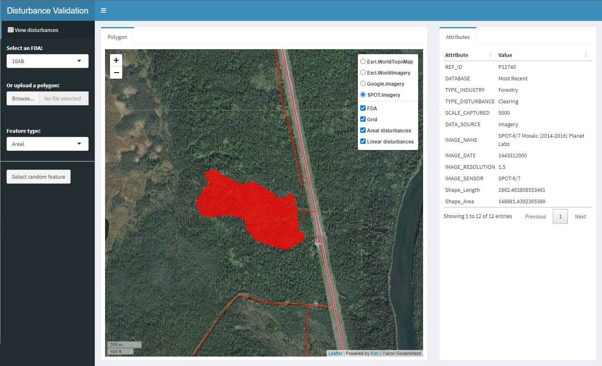

## Disturbance Validation

January 14, 2026

The Disturbance Validation app is a Shiny app that enables users to i) interactively examine linear and areal surface disturbance features along with several satellite imagery sources, ii) validate industry and disturbance type attributes, and iii) randomly select individual features and their associated attributes. This permits alternative digitizers or other users to quickly look at the digitized features and their assigned attributes, and visually compare them to more than one high resolution imagery source. Three satellite images are available for viewing: Esri WorldImagery, Google Imagery, and SPOT Imagery for circa 2021.

The app can be run from a local machine using the following steps:

  1. Install R (download from r-project.org and follow instructions)
  2. Install the following additional packages1:

    install.packages(c("markdown","sf","leaflet","leaflet.esri","dplyr","shinydashboard","DT","summarytools"))

  3. Start the Shiny app:

    shiny::runGitHub(repo="beaconsproject/disturbance_mapping", subdir="validation")

1Depending on the version of R you are running, you may need to install the leaflet.esri package separately using this command: devtools::install_github("bhaskarvk/leaflet.esri")

