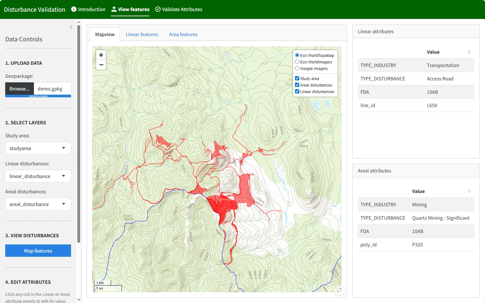

## Disturbance Validation

June 3, 2026

The Disturbance Validation app is a Shiny app that enables users to i) interactively examine linear and areal surface disturbance features along with high resolution ESRI and Google satellite imagery, ii) edit linear and areal disturbance attribute values if needed, and iii) validate industry and disturbance type attribute values. This permits users or reviewers to quickly look at the digitized features and their assigned attributes, ensure that only permitted values are used for disturbance types, and edit them if necessary.

The easiest way to run the app is to go to:

- https://beaconsproject.shinyapps.io/disturbance_validation/

Alternatively, the app can be run from a local machine using the following steps:

  1. Install R (download from r-project.org and follow instructions)
  2. Install the following additional packages1:

    install.packages(c("markdown","sf","leaflet","dplyr","bslib","DT","summarytools"))

  3. Start the Shiny app:

    shiny::runGitHub(repo="beaconsproject/disturbance_mapping", subdir="validation")

1Depending on the version of R you are running, you may need to install the leaflet.esri package separately using this command: devtools::install_github("bhaskarvk/leaflet.esri")

