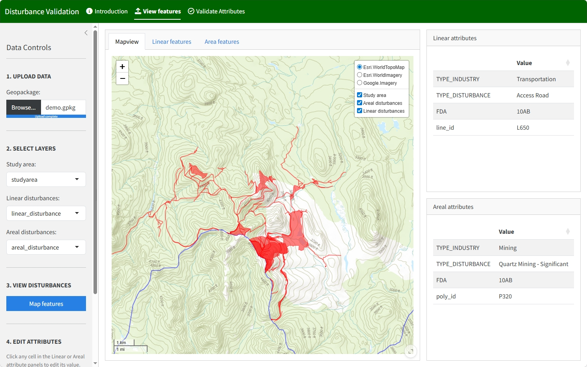

## Disturbance Validation

The Disturbance Validation app is a Shiny app that enables users to i) interactively examine linear and areal surface disturbance features along with high resolution ESRI and Google satellite imagery, ii) edit linear and areal disturbance attribute values if needed, and iii) validate industry and disturbance type attribute values. This permits users or reviewers to quickly look at the digitized features and their assigned attributes, ensure that only permitted values are used for disturbance types, and edit them if necessary.

#### Features

| Feature | Description |
|---------|-------------|
| Map view | Leaflet map with ESRI Imagery / Topo / Gray basemaps and a layer-toggle control |
| Table view | Tables displaying the values of the Linear and Areal disturbance features |
| Scale bar | Dynamic `1:X` scale indicator in the map header |
| Grid generator | Create an *n × n* km grid (1–25 km) intersecting the study area |
| Click to inspect | Click any linear or areal feature to see its attributes in the side cards |
| Editable attributes | Modify any field value directly in the attribute cards |
| Save edits | *Save Attribute Edits* commits changes back to the in-memory layers |
| Export | *Export as GeoPackage* writes all layers (including the grid if created) to a new `.gpkg`, then a download button appears |

### Structure

The Disturbance Validation app consists of Three sections:

### Introduction

This section includes this overview page plus a tab describing all permitted industry and disturbance types. The Dataset requirements tab provides information on layer requirements for running the app.

### View Features

This section allows the user to view a map of digitized disturbance features over satellite imagery, and select features on the map to view and edit their attributes. 

The Linear features and Areal features tabs allow the user to view the attribute table for all linear or areal (polygonal) features in the dataset.

### Validate attributes

This section allows the user to view a summary of linear and areal disturbance attributes, validate their values, and identify errors. Results will be displayed in the 4 tabs on the right.

### User Guide

Follow these steps to validate digitized disturbances:

1. Upload data: Upload a geopackage (".gpkg") containing a study area boundary, linear disturbances, and areal disturbances (see dataset requirements). 
2. Select layer names from the 3 dropdown boxes and click **Map features**.
3. View results: results will be displayed in the 4 tabs on the right.
4. Under the **Validate Attributes** section, upload a .csv of approved attributes (the approved combination of Industry and Disturbance types) and click **Validate attributes**. 
- A .csv of approved attributes is available here: https://github.com/beaconsproject/disturbance_validation/blob/main/www/yg_industry_disturbance_types.csv
- A summary of the database, errors, and permitted values based on the .csv will be presented in the four tabs to the right
- To edit the attributes of a feature, the user can: 
  - Search for the feature ID under the search tab on the left or view and flip through the dataset attribute table
  - Select a feature in the mapview and edit its attributes in the feature table on the right. 
  

